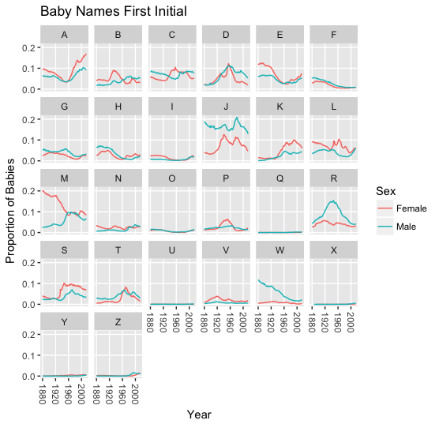

```{r, echo=FALSE, eval=TRUE}
answers<-params$answers
```

```{r global_options, echo = FALSE, include = FALSE}
knitr::opts_chunk$set(echo=answers, eval=answers,
                      warning = FALSE, message = FALSE,
                      cache = FALSE, tidy = FALSE)
```

# Note

Also see visualization exercises that are part of the [Intro to R workshop](https://github.com/nuitrcs/intro_r_workshop/tree/master/coreexercises): Part 5.

# Setup

```{r, echo=TRUE, eval=FALSE}
install.packages(c("tidyverse","babynames"))
```

```{r, echo=TRUE, eval=TRUE}
library(tidyverse)
library(babynames)
```


These exercises use objects and data created during the workshop session.  Relevant code follows if you don't already have these objects created.


```{r, echo=TRUE, eval=TRUE}
data(babynames)

babynames <- mutate(babynames, initial=substr(name, 1, 1))
initial_props <- group_by(babynames, year, sex, initial) %>% 
  summarize(count=sum(n), totalprop=sum(prop)) %>%
  ungroup()

topnames<-babynames %>% 
  filter(year>=1950) %>% 
  group_by(name) %>% 
  summarize(total=sum(n)) %>%
  arrange(desc(total)) %>%
  head(1000) %>%
  inner_join(babynames) %>%
  filter(year >= 1950) %>%
  mutate(sex=recode(sex, "F"="Female", "M"="Male")) %>%
  group_by(name, sex, total) %>%
  summarize(sextotal=sum(n)) %>%
  spread(key=sex, value=sextotal) %>%
  mutate(ratio=(Male-Female)/total)
```


Note: most solutions are written with `dplyr`, although you don't need to use it to do them.  Some non-`dplyr` answers are provided.

# Exercise 1

Part 1: Make a plot similar to Example 1 in the workshop:


but group by sex instead of initial letter.  Only plot names that begin with vowels.  What formatting changes do you want to make?

Part 2: Then change the plot to a stacked area plot so you can see the total number of names starting with vowels over time.  Hint: find the correct geom to use, then look at the help to find the option to make it stacked.  Hint 2: the aesthetic `color` refers to line or marker color.  `fill` may be useful instead.

Note: The facet labels are pulled automatically from the names of the variable after it's coverted to a factor.  To change the labels (or the order of the groups), you can change the factor.  This is a little tricky.  The answer will include this code, but you may want to leave those labels as is for now.  Another option is to use a [`labeller` function](http://ggplot2.tidyverse.org/reference/labellers.html).

```{asis}
### Solution

Part 1
```

```{r}
filter(initial_props, initial %in% c("A","E","I","O","U","Y")) %>% 
  mutate(sex=factor(sex, levels=c("F","M"), labels=c("Female", "Male"))) %>%
  ggplot(aes(y=totalprop, x=year, color=initial)) +
  geom_line() + 
  facet_wrap(~sex) +
  labs(title="Baby Names First Initial", x="Year", y="Proportion of Babies") +
  scale_color_discrete(name="First Initial") +
  theme(axis.text.x = element_text(angle = -90, vjust=.5)) 
```

```{asis}
Above, with a `labeller` function
```

```{r, eval=FALSE}
filter(initial_props, initial %in% c("A","E","I","O","U","Y")) %>% 
  ggplot(aes(y=totalprop, x=year, color=initial)) +
  geom_line() + 
  facet_wrap(~sex, labeller=as_labeller(function(x) ifelse(x=='M','Male','Female'))) +
  labs(title="Baby Names First Initial", x="Year", y="Proportion of Babies") +
  scale_color_discrete(name="First Initial") +
  theme(axis.text.x = element_text(angle = -90, vjust=.5)) 
```

```{asis}
To change the factor not using `dplyr`:
```

```{r, eval=FALSE}
initial_props$sex<-factor(initial_props$sex, levels=c("F","M"), labels=c("Female", "Male"))
```


```{asis}
Part 2
```

```{r}
filter(initial_props, initial %in% c("A","E","I","O","U","Y")) %>%
  mutate(sex=factor(sex, levels=c("F","M"), labels=c("Female", "Male"))) %>%
  ggplot(aes(y=totalprop, x=year, fill=initial)) +
  geom_area(position="stack") + 
  facet_wrap(~sex) +
  labs(title="Baby Names First Initial", x="Year", y="Proportion of Babies") +
  scale_fill_discrete(name="First Initial") +
  theme(axis.text.x = element_text(angle = -90, vjust=.5)) 
```


# Exercise 2

Using `topnames`, make another scatterplot, but filter out names that aren't unisex (use `ratio` and set the cutoff youself).  Change the size (the area, not the radius) of the points to be scaled according to the total number of people with the name.  Fix the legend title.  Set the x and y axes to have the same limits.  Apply a theme of your choice to the plot.

Hint: you need an option at the bottom of the scales section on the `ggplot2` cheatsheet.

```{asis}
### Solution
```


```{r}
topnames %>% 
  filter(abs(ratio) < .35) %>%
  ggplot(aes(x=Male, y=Female, size=Female+Male)) +
  geom_point() +
  scale_size_area(name="Total") +
  xlim(0,110000) +
  ylim(0,110000) +
  theme_few() # you can use a different one
```


```{r, eval=FALSE}
# above, without dplyr
ggplot(topnames[topnames$ratio < .35,], 
       aes(x=Male, y=Female, size=Female+Male)) +
  geom_point() +
  scale_size_area(name="Total") +
  xlim(0,110000) +
  ylim(0,110000) +
  theme_few()
```


# Exercise 3: Visualization and Missing Observations

This exercise is a bit more about data manipulation than visualization, but getting your data in the correct format is a crucial part of making a good plot.  

In the first example in the [`plotly` workshop materials](https://www.github.io/nuitrcs/ggplotworkshop/plotly.html), we look at names that start with A, divided by their second letter.  For names with uncommon second letters, there might be a 0 for some years, so we might be missing some years in our data.  On the scale of the initial plot, this isn't a big deal.  If we were looking at uncommon names, it might be.

1) Make a plot of the 5 most uncommon A? female names over time.  Plot both a line and a point for each observation.  Are there any years with data missing for any of the A? combinations?

2) How can you check the data for these missing observations? (They aren't missing values -- they're just not in the data.)

3) How can you fill in the missing values?

4) Remake the plot in step 1 with the corrected data.


```{r, echo=TRUE, eval=TRUE}
babynames <- mutate(babynames, first2=substr(name, 1, 2))
anames <- babynames %>%
  filter(initial=="A") %>%
  group_by(year, sex, first2) %>% 
  summarize(count=sum(n), totalprop=sum(prop)) %>%
  ungroup()
```


```{asis}
### Solution
```

```{r}
unpopular <-anames %>% 
  filter(sex=="F") %>%
  group_by(first2) %>%
  summarize(total=n()) %>%
  arrange(total) %>%
  slice(1:5) %>% 
  pull(first2)

anames %>%
  filter(sex=="F", first2 %in% unpopular) %>%
  ggplot(aes(x=year, y=totalprop, color=first2)) +
  geom_line() + 
  geom_point()
```

```{asis}
Hmm, there's basically no points for about 20 years after WWII, and many combinations don't show up in early years.  How can we see this in the data?

We could check for the number of observations per year:
```

```{r}
anames %>% 
  group_by(year) %>%
  summarize(n()) 
```

```{asis}
That makes it clear there are some missing, but how to see what's missing?  We could make a data frame with all of the observations we expect to have, join our actual data to it, and see what's missing then.
```

```{r}
fulldata <- data.frame(first2=rep(paste0("A",letters), each=2015-1880+1), 
                       year=rep(1880:2015, 26))
missingobs <- fulldata %>% 
  left_join(filter(anames, sex=="F")) %>%
  filter(is.na(count))
dim(missingobs)
head(missingobs)
```

```{asis}
We can now build on the approach above to create a full data set.
```

```{r}
fulldata <- fulldata %>%
  left_join(filter(anames, sex=="F")) %>%
  select(-sex) %>% # we only kept female anyway
  mutate(totalprop = ifelse(is.na(totalprop), 0, totalprop),
         count = ifelse(is.na(count), 0, count))
```

```{r}
fulldata %>%
  filter(first2 %in% unpopular) %>%
  ggplot(aes(x=year, y=totalprop, color=first2)) +
  geom_line() + 
  geom_point()
```

```{asis}
This gives us a somewhat different picture of the data, especially before the mid 1960s.
```


